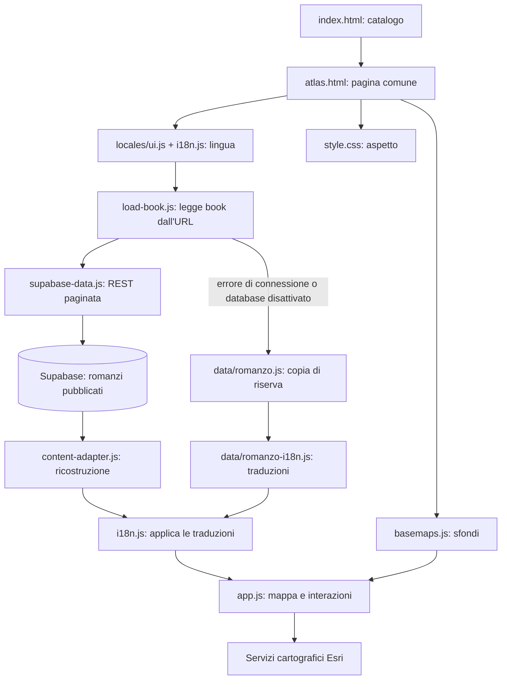

# Mappa dei file di Novel Locator

Il sito è scritto in HTML, CSS e JavaScript e viene ospitato su GitHub Pages dalla cartella `docs/`. La pagina della mappa legge i dati pubblicati da Supabase; i file JavaScript dei romanzi restano come copia di riserva. Il repository contiene lo schema PostgreSQL e gli strumenti TypeScript di importazione e ricostruzione. La login non è ancora implementata. I CSV sono esportazioni scaricabili e non alimentano la mappa; il catalogo della home è statico.

## Struttura

```text
novellocator/
├── docs/                          Sito pubblicato
│   ├── index.html                 Catalogo dei romanzi
│   ├── atlas.html                 Pagina comune della mappa
│   ├── app.js                     Motore dell'atlante
│   ├── style.css                  Aspetto e impaginazione
│   ├── basemaps.js                Elenco degli sfondi cartografici
│   ├── load-book.js               Caricamento del romanzo richiesto
│   ├── supabase-config.js         URL e chiave pubblica del progetto
│   ├── supabase-data.js           Lettura REST paginata delle tabelle
│   ├── content-adapter.js         Ricostruzione dei dati, generata da TypeScript
│   ├── i18n.js                    Gestione delle lingue
│   ├── locales/
│   │   └── ui.js                  Traduzioni dell'interfaccia
│   ├── data/
│   │   ├── ulisse.js              Dati di Ulisse
│   │   ├── ulisse-i18n.js         Traduzioni dei contenuti di Ulisse
│   │   ├── proust.js              Dati di Alla ricerca del tempo perduto
│   │   ├── proust-i18n.js         Traduzioni dei contenuti di Proust
│   │   ├── war-and-peace.js       Dati di Guerra e pace
│   │   ├── war-and-peace-i18n.js  Traduzioni dei contenuti di Tolstoj
│   │   ├── moby-dick.js           Dati di Moby-Dick
│   │   └── moby-dick-i18n.js      Traduzioni dei contenuti di Melville
│   ├── *.csv                      Esportazioni dei luoghi nelle quattro lingue
│   └── LEGGIMI.md                 Documentazione italiana e metodo geografico
├── tests/
│   ├── run.cjs                    Esegue tutti i controlli
│   ├── check-*.cjs                Controlli specifici
│   └── fixtures/                  Dati di riferimento per i controlli
├── database/
│   ├── migrations/                Schema PostgreSQL e permessi Supabase
│   ├── generated/                 SQL e dati preparati, esclusi da Git
│   └── README.md                  Modello, importazione e passi successivi
├── scripts/database/
│   ├── model.ts                   Normalizzazione e generazione SQL
│   ├── content.ts                 Ricostruzione condivisa fra browser e strumenti
│   ├── build-browser.ts           Genera content-adapter.js per il browser
│   ├── prepare.ts                 Genera SQL di importazione e rapporto
│   └── export.ts                  Ricostruisce i dataset del sito
├── tsconfig.json                  Configurazione TypeScript degli strumenti
├── package.json                   Configurazione del progetto e comando npm test
├── README.md                      Presentazione e istruzioni in inglese
├── MAPPA-FILE.md                  Questo documento
├── .gitignore                     File esclusi dal caricamento su Git
└── .gitattributes                 Regole Git per formati e fine riga
```

## File che fanno funzionare il sito

| File | Cosa fa |
| --- | --- |
| `docs/index.html` | Mostra il catalogo, le schede dei romanzi e i collegamenti alle relative mappe. Contiene anche le illustrazioni SVG delle schede. |
| `docs/atlas.html` | Definisce la struttura della pagina comune: elenco dei capitoli, TOC degli strati, selettore dello sfondo, contenitore della mappa, legenda, scheda del luogo, comandi fullscreen, menu dei capitoli e popup. |
| `docs/app.js` | Usa i dati del romanzo per gestire ArcGIS, marker e colori, capitoli, vista globale, strati visibili, selezione, fonti, citazioni, Street View, fullscreen e popup. Su mobile calcola la porzione di mappa non coperta dal popup per centrare il punto. È condiviso da tutti i romanzi. |
| `docs/style.css` | Definisce colori, caratteri, dimensioni, layout per desktop/mobile, legenda, pulsanti, fullscreen, menu e popup. |
| `docs/basemaps.js` | Definisce i cinque sfondi disponibili e i loro identificativi: OpenStreetMap tramite Esri, ortofoto, stradale, topografica e grigio chiaro. Il primo è quello predefinito. |
| `docs/load-book.js` | Legge `book` dall'URL, carica il dataset del romanzo e le sue traduzioni, applica la lingua e avvia `app.js`. Se il titolo non è disponibile mostra un messaggio. |
| `docs/supabase-config.js` | Configura URL, chiave publishable e attivazione del database. È pubblico. |
| `docs/supabase-data.js` | Legge il romanzo pubblicato e le sue righe da Supabase tramite REST, con paginazione e timeout. |
| `docs/content-adapter.js` | Ricostruisce il formato del motore comune. Si genera con `npm run build:browser` dal sorgente TypeScript `scripts/database/content.ts`. |
| `docs/i18n.js` | Sceglie la lingua da URL, preferenza salvata o impostazione predefinita; traduce l'interfaccia e i contenuti; conserva capitolo, punto, strati e sfondo quando si cambia lingua. |
| `docs/locales/ui.js` | Contiene le lingue disponibili e le traduzioni delle diciture comuni: pulsanti, etichette, messaggi, legenda e comandi. Lingue: inglese, italiano, francese e spagnolo. |

## Dati dei romanzi

I quattro file `docs/data/<romanzo>.js` hanno la stessa struttura e assegnano i dati a `window.atlasData`. Gli identificativi sono `ulisse`, `proust`, `war-and-peace` e `moby-dick`.

| Campo | Contenuto |
| --- | --- |
| `book` | Titolo, autore, anno, impostazioni iniziali della mappa, collegamenti, note e informazioni per gli scaricamenti. |
| `chapters` | Capitoli, episodi, volumi o parti; titoli, descrizioni e luoghi associati. |
| `places` | Catalogo dei luoghi del dataset principale: nome, coordinate, tipo geometrico, precisione, note e fonti. |
| `citedPlaces` | Catalogo geografico dei luoghi aggiunti come citazioni. |
| `chapters[].places` | Identificativi dei luoghi principali della sezione. |
| `chapters[].placeCategories` | Eventuali classificazioni dei luoghi principali come «citati»; in assenza di indicazioni il motore li considera luoghi dell'azione. |
| `chapters[].citations` | Riferimenti ai luoghi citati nella sezione, con il passo originale e la sua fonte. |
| `chapters[].placeExcerpts` | Citazioni collegate ai luoghi principali: originale e traduzioni di pubblico dominio disponibili. |
| `chapters[].placeQuotes` | Citazioni originali presenti in alcuni dataset, in particolare Moby-Dick. |
| `chapters[].excerpts` | Estratti generali della sezione conservati nei dati. Il relativo blocco non viene più mostrato nella pagina, secondo la scelta dell'utente. |
| `chapters[].unlocatedPlaces` | Eventuali ambientazioni prive di coordinate attendibili, descritte senza inventare un punto sulla mappa. |

I file `docs/data/<romanzo>-i18n.js` assegnano a `window.atlasTranslations` le traduzioni dei contenuti descrittivi del romanzo. Le citazioni originali e le loro traduzioni verificate sono invece nei dataset, insieme alle fonti: non sono tradotte automaticamente dal dizionario dell'interfaccia.

## Esportazioni CSV

Nei nomi seguenti, `<lingua>` significa `en`, `it`, `fr` o `es`. Ogni famiglia comprende quattro file.

| File o famiglia | Contenuto |
| --- | --- |
| `docs/places-<lingua>.csv` | Catalogo principale dei luoghi di Ulisse, con coordinate, capitoli, precisione e fonti. |
| `docs/luoghi.csv` | Esportazione italiana del catalogo di Ulisse mantenuta con il nome iniziale. |
| `docs/proust-places-<lingua>.csv` | Luoghi principali di Proust associati alle sezioni. |
| `docs/war-and-peace-places-<lingua>.csv` | Luoghi principali di Guerra e pace associati alle sezioni. |
| `docs/moby-dick-places-<lingua>.csv` | Ambientazioni principali di Moby-Dick e voci senza coordinate verificate. |
| `docs/ulisse-citations-<lingua>.csv` | Riferimenti geografici aggiunti come luoghi citati in Ulisse. |
| `docs/proust-citations-<lingua>.csv` | Riferimenti geografici aggiunti come luoghi citati in Proust. |
| `docs/war-and-peace-citations-<lingua>.csv` | Riferimenti geografici aggiunti come luoghi citati in Tolstoj. |
| `docs/moby-dick-citations-<lingua>.csv` | Riferimenti geografici ripristinati come luoghi citati in Melville. |

Cambiare un CSV non modifica la mappa. Quando si cambiano i dati di un romanzo, le esportazioni interessate devono essere aggiornate separatamente.

## Controlli automatici

`tests/run.cjs` esegue i dodici controlli seguenti. `npm test` aggiunge il controllo TypeScript e `tests/check-database.ts`, che esegue le migrazioni, l'importazione e le policy in PostgreSQL/PGlite. Richiedono Node.js 20 o successivo e `npm ci`. I controlli dell'interfaccia usano simulazioni del browser e di ArcGIS: non verificano il rendering reale WebGL o la disponibilità dei servizi cartografici.

| File | Cosa verifica |
| --- | --- |
| `tests/check-episodes.cjs` | Episodi e coordinate di Ulisse, selezione, navigazione e inquadrature. |
| `tests/check-locales.cjs` | Quattro lingue, traduzioni e conservazione di coordinate, fonti e stato. |
| `tests/check-generic-atlas.cjs` | Funzionamento del motore con un altro dataset e capitoli con identificativi non consecutivi. |
| `tests/check-proust.cjs` | Dati, fonti, lingue, CSV e selezione dei luoghi di Proust. |
| `tests/check-war-and-peace.cjs` | Dati geografici, fonti e comportamento delle sezioni di Tolstoj. |
| `tests/check-moby-dick.cjs` | Ambientazioni dell'azione, citazioni originali, fonti e sezioni senza coordinate di Melville. |
| `tests/check-excerpts.cjs` | Integrità degli estratti originali e delle traduzioni, lingue, attribuzioni e fonti. |
| `tests/check-global-view.cjs` | Vista di tutti i luoghi, marker unici, collegamenti alle sezioni e stato nell'URL. |
| `tests/check-street-view.cjs` | Collegamenti Google Street View, coordinate e comportamento delle finestre. |
| `tests/check-osm.cjs` | Sfondi cartografici, crediti, cambio basemap e gestione degli errori. |
| `tests/check-layers.cjs` | Luoghi citati, categorie, colori, forme, TOC, vista globale e CSV. |
| `tests/check-fullscreen.cjs` | Fullscreen, popup, menu dei capitoli, tastiera/touch e centraggio mobile nell'area visibile. |

I file di `tests/fixtures/` sono riferimenti usati dai controlli, non i dati caricati dal sito:

| File | Contenuto |
| --- | --- |
| `ulisse-data.json` | Copia di riferimento del dataset principale di Ulisse. |
| `niah-dublin.json` | Dati di riferimento del censimento NIAH per il confronto delle coordinate di Dublino. |
| `proust-data.json` | Copia di riferimento dei dati principali di Proust. |
| `proust-geocoding.json` | Riscontri geografici delle posizioni di Proust. |
| `war-and-peace-sources.json` | Riscontri testuali e geografici delle ambientazioni di Tolstoj. |
| `moby-dick-sources.json` | Riscontri testuali e geografici delle ambientazioni di Melville. |
| `text-excerpts.json` | Estratti originali e traduzioni con fonti, per controllarne l'integrità. |
| `original-citations.json` | Riferimenti geografici aggiunti, passi originali, coordinate e registrazione delle sezioni analizzate. |

## Come vengono caricati i file



## Dove intervenire

| Obiettivo | File da modificare |
| --- | --- |
| Cambiare colori, dimensioni o layout | `docs/style.css` |
| Cambiare la struttura della pagina della mappa | `docs/atlas.html` |
| Cambiare navigazione, marker, popup o fullscreen | `docs/app.js` |
| Cambiare gli sfondi disponibili o quello predefinito | `docs/basemaps.js` |
| Correggere una posizione o una citazione | Dataset del romanzo in `docs/data/`; aggiornare eventuali traduzioni e CSV interessati. |
| Tradurre un pulsante o un messaggio comune | `docs/locales/ui.js` |
| Tradurre una descrizione di un romanzo | `docs/data/<romanzo>-i18n.js` |
| Aggiungere un romanzo | Nuovo dataset e relativo file di traduzioni in `docs/data/`, scheda in `docs/index.html`, esportazioni e controlli pertinenti. Il motore resta condiviso. |
| Aggiungere una lingua | `docs/locales/ui.js`, dizionari dei romanzi e relative esportazioni. |
| Cambiare ciò che finisce nel repository | `.gitignore` |

La cartella `work/` esterna a questo repository contiene script e materiali temporanei di ricerca: non viene pubblicata e non è necessaria per consultare il sito.
