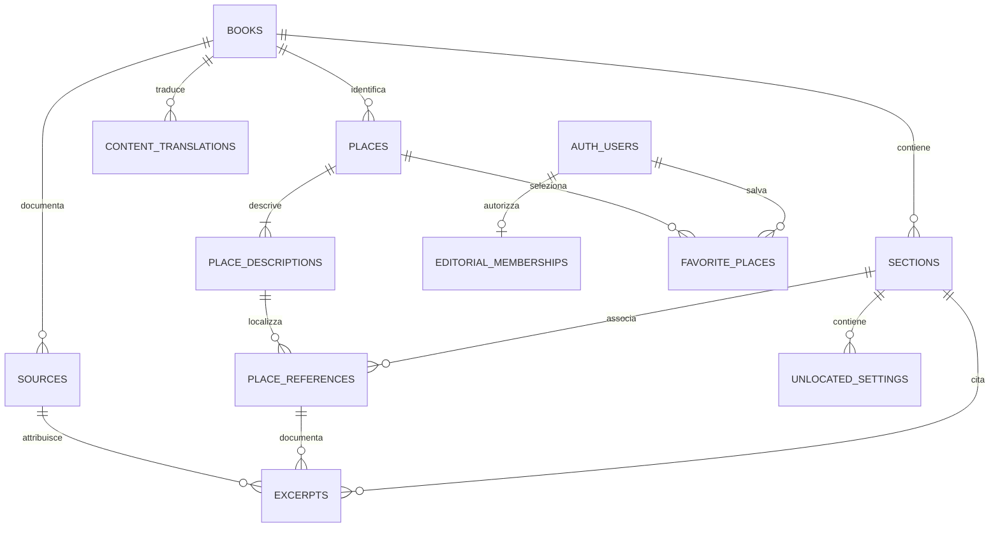

# Database di Novel Locator

Schema PostgreSQL/Supabase, importazione dei contenuti esistenti e permessi per la futura login. La pagina `atlas.html` legge i romanzi pubblicati dal progetto Supabase configurato in `docs/supabase-config.js`. I file di `docs/data/` restano la copia di riserva e la fonte dell'importazione iniziale. Il catalogo della home resta statico.

## Collegamento del sito

`docs/supabase-config.js` contiene URL, chiave pubblica publishable e `enabled`. È un file pubblico: non inserire password, chiavi secret o service_role. La Data API deve essere attiva e le migrazioni devono concedere SELECT al ruolo anon, con RLS per leggere solo libri pubblicati.

`docs/supabase-data.js` interroga le nove tabelle tramite REST in HTTPS, filtrando il romanzo e paginando con ordinamento stabile. Non usa credenziali amministrative. `docs/content-adapter.js` ricostruisce il formato già usato dalla mappa: viene generato da `scripts/database/content.ts`, lo stesso codice usato dagli strumenti di importazione/esportazione. Dopo aver modificato questo sorgente eseguire `npm run build:browser` e includere il file generato nel commit.

Se la connessione fallisce entro 20 secondi, il loader usa la copia statica e mostra un avviso in EN/IT/FR/ES. Un libro non pubblicato o inesistente non attiva la copia di riserva. `window.atlasDataSource` indica `supabase` o `static` nella console del browser. Gli aggiornamenti del database sono letti al caricamento della pagina; non è una sincronizzazione in tempo reale.

`npm run test:supabase` verifica paginazione, ricostruzione completa, traduzioni, ritorni a capo del copia-incolla su Windows e avvio/fallback del loader. `npm run test:supabase -- --live` confronta, in sola lettura, i quattro romanzi presenti nel progetto con i dati versionati. Le coordinate sono confrontate entro 1e-12 gradi per la serializzazione PostgreSQL dei numeri in virgola mobile.

## Modello



| Tabella | Funzione |
| --- | --- |
| `books` | Romanzi, lingua originale e stato `draft`/`published`. |
| `sections` | Capitoli, episodi, volumi o parti, con ordine distinto dall'identificativo. |
| `places` | Identificativi geografici e coordinate WGS84. Gli identificativi sono separati per romanzo. |
| `place_descriptions` | Nome, forma geometrica, precisione, note e fonti. Le descrizioni principali e quelle delle citazioni possono differire, condividendo le coordinate. |
| `place_references` | Legame tra sezione e luogo, ordine e categoria `action`/`mentioned`. La categoria appartiene alla scena, non al luogo. |
| `sources` | Fonti testuali, geografiche e delle edizioni, deduplicate per romanzo senza perdere metadati. |
| `excerpts` | Testo originale e traduzioni disponibili, lingua, attribuzione e fonti. Conserva anche gli estratti generali non più mostrati dalla pagina. |
| `unlocated_settings` | Ambientazioni senza coordinate attendibili, con citazione e fonte. |
| `content_translations` | Dizionari descrittivi esistenti nelle quattro lingue. Una chiave SHA-256 permette di conservare testi lunghi senza indicizzarli integralmente. |
| `editorial_memberships` | Ruoli `editor` e `admin` associati agli utenti Supabase Auth. |
| `favorite_places` | Preferiti personali, predisposti per una futura interfaccia autenticata. |

I campi `metadata` JSONB conservano impostazioni della pagina e proprietà secondarie del formato attuale. Coordinate, relazioni, categorie, citazioni e fonti hanno colonne e vincoli propri: non sono un unico JSON per romanzo. Gli elenchi `legacy_fields` consentono di ricostruire esattamente anche campi facoltativi vuoti.

Non vengono fusi automaticamente luoghi di romanzi diversi: lo stesso identificativo storico può indicare entità diverse. Ad esempio Londonbridge Road a Dublino e Londra non devono diventare un solo luogo. Un futuro catalogo geografico condiviso richiederà riscontri espliciti.

## Preparazione locale

Servono Node.js 20 o successivo e le dipendenze del repository. Non serve installare un server PostgreSQL.

```powershell
npm ci
npm run db:prepare
npm run db:export
npm test
```

`db:prepare` legge gli otto file dati/traduzioni in `docs/data/`, normalizza i contenuti e verifica che siano ricostruibili senza differenze. Genera:

- `database/generated/content.sql`: importazione SQL in transazione, con upsert a blocchi.
- `database/generated/sql-editor/`: file numerati da massimo 250 kB per il SQL Editor, guida `IMPORTA.md` e query finale `verifica.sql`.
- `database/generated/content.json`: rappresentazione delle righe normalizzate per esportazione e revisione.
- `database/generated/report.json`: conteggi e risultato della verifica.

La cartella `generated/` è esclusa da Git: si rigenera dai dati versionati. Le migrazioni, gli script e i test sono invece versionati.

`db:export` ricostruisce i quattro dataset e i quattro dizionari nel formato usato dal sito, nella cartella `database/generated/site-data/`. Non sovrascrive `docs/data/`. In questa fase legge il file di righe preparato localmente; non interroga Supabase. Il test verifica separatamente la ricostruzione dopo un'importazione reale in PostgreSQL tramite PGlite.

## Contenuti importati

| Romanzo | Sezioni | Luoghi distinti nel romanzo | Riferimenti sezione–luogo |
| --- | ---: | ---: | ---: |
| Ulisse | 18 | 170 | 315 |
| Alla ricerca del tempo perduto | 7 | 90 | 264 |
| Guerra e pace | 17 | 91 | 227 |
| Moby-Dick | 136 | 276 | 595 |
| Totale | 178 | 627 | 1.401 |

Sono conservati 1.498 estratti originali/traduzioni, 8.466 voci dei dizionari descrittivi, 1.032 fonti e 14 ambientazioni senza coordinate. I 627 luoghi non sono un conteggio geografico unico tra romanzi. Gli estratti comprendono sia quelli dei luoghi sia quelli generali archiviati.

## Applicazione a Supabase

Il passaggio successivo è creare un progetto Supabase. Nel suo SQL Editor si applicano, in ordine:

1. `database/migrations/001_content.sql`
2. `database/migrations/002_supabase_access.sql`
3. `database/migrations/003_book_maps.sql`

Le migrazioni si applicano una sola volta a un progetto nuovo. La seconda richiede lo schema `auth` e i ruoli standard di Supabase. Il test locale li simula, ma in produzione li crea Supabase.

Per importare dal SQL Editor, seguire `database/generated/sql-editor/IMPORTA.md`: copiare ed eseguire ogni file numerato in ordine, attendendo il successo prima del successivo. Ogni file contiene una transazione completa; può essere ripetuto senza duplicare le righe. Al termine eseguire `verifica.sql` e confrontare i conteggi con la guida. Non incollare il file completo `content.sql` nel SQL Editor: supera il limite di dimensione.

In alternativa, eseguire `database/generated/content.sql` con una connessione amministrativa tramite il client `psql`, usando la connessione indicata nel pannello Supabase; basta il client, senza un server PostgreSQL locale:

```powershell
psql --dbname $env:DATABASE_URL --set ON_ERROR_STOP=1 --file database/generated/content.sql
```

`DATABASE_URL` deve essere configurata localmente, senza salvarla nel repository. Nessuna credenziale è necessaria per preparare i file o eseguire i test. Non inserire credenziali PostgreSQL o chiavi amministrative nel JavaScript pubblico.

L'importazione è destinata alla migrazione iniziale. Ripeterla sugli stessi dati non duplica le righe; aggiorna i campi già presenti ai valori dei file sorgente. Non elimina righe che successivamente spariscono dai file. I nuovi romanzi sono pubblicati perché provengono dall'atlante pubblico; sui romanzi già presenti viene conservato lo stato di pubblicazione del database. Dopo l'avvio della gestione editoriale, il database diventerà la fonte principale e occorrerà usare il percorso di esportazione invece di reimportare periodicamente i file storici.

## Permessi predisposti

- Senza login: lettura dei contenuti dei romanzi pubblicati; nessuna modifica.
- Utente autenticato: stessa lettura pubblica e gestione dei propri preferiti; nessuna modifica editoriale.
- Redattore: lettura delle bozze e modifica dei contenuti; nessuna assegnazione di ruoli o eliminazione di romanzi.
- Amministratore: gestione dei contenuti, dei romanzi e dei ruoli.

Le regole RLS e i privilegi SQL si applicano a tutte le tabelle. Le funzioni di controllo dei ruoli sono nello schema `private`, che deve restare fuori dagli schemi esposti dalla Data API. La registrazione non assegna ruoli editoriali. Il primo amministratore si assegna dal SQL Editor dopo aver creato il relativo utente Supabase Auth:

```sql
insert into public.editorial_memberships(user_id,role)
values ('UUID-DELL-UTENTE', 'admin');
```

Lo script non crea account, non invia email e non aggiunge ancora una pagina di login. I contenuti delle bozze non devono essere inclusi nelle future esportazioni pubbliche.

## Verifica

`npm test` esegue i controlli esistenti del sito, il controllo TypeScript e il test database. PGlite esegue il motore PostgreSQL in locale e in memoria: le migrazioni, i vincoli e le policy non sono soltanto cercati come testo o simulati.

Il test importa due volte, verifica la ricostruzione esatta dei contenuti e controlla lettura pubblica, invisibilità delle bozze, divieti di modifica, isolamento dei preferiti, permessi editoriali e impossibilità di promuoversi autonomamente ad amministratore. Prima del collegamento pubblico saranno necessari anche i controlli sul progetto Supabase effettivo, la configurazione Auth e il client del sito.

## Mappe fantasy e cartografia dedicata

La migrazione `003_book_maps.sql` predispone la cartografia per romanzo senza attribuire latitudine/longitudine terrestri ai mondi immaginari:

| Tabella | Funzione |
| --- | --- |
| `book_maps` | Mappe associate a un romanzo: mondo reale/immaginario, webmap Esri, immagine o composizione di layer; sistema di coordinate, vista iniziale, attribuzione e fonte dei diritti. Una sola mappa predefinita per romanzo. |
| `section_maps` | Mappe disponibili per una sezione e sua eventuale mappa predefinita. In assenza di un override il futuro visualizzatore userà la mappa del romanzo. |
| `map_layers` | Layer dedicati: tipo, ruolo, URL o identificativo del layer nella webmap, ordine, visibilità iniziale, opacità, configurazione e attribuzione. |
| `place_positions` | Posizione X/Y di un luogo su una specifica mappa, con metodo e fonte. Mappe o edizioni diverse possono localizzare lo stesso luogo con coordinate diverse. |

`coordinate_space` distingue `wgs84` da `cartesian`; `world_type` distingue geografia reale e immaginaria indipendentemente dal sistema tecnico usato per visualizzarla. Il campo `spatial_reference` conserva il riferimento richiesto da Esri, da verificare con i servizi o le immagini effettivamente scelti. Una webmap registra il `portal_item_id`; un'immagine registra l'URL. Non si presume che ogni mappa fantasy disponibile sia già compatibile con ArcGIS.

Le coordinate X/Y non possono essere associate a una mappa con un sistema diverso e non vengono convertite automaticamente in WGS84. I luoghi immaginari lasciano vuote entrambe le coordinate terrestri in `places`, usando invece `place_positions`. Le coordinate dei romanzi già presenti restano valide e inalterate. Lo stesso luogo può comparire su una mappa generale e su una regionale, con posizioni e fonti distinte.

Questa è una predisposizione del database: il visualizzatore fantasy e l'esportazione delle nuove configurazioni non sono ancora implementati. L'esportatore attuale resta dedicato ai quattro dataset geografici e rifiuta luoghi senza coordinate WGS84, anziché produrre marker terrestri errati. Il futuro visualizzatore dovrà applicare webmap/layer e coordinate specifiche; Street View e ortofoto terrestri saranno disponibili solo quando pertinenti. Login, fonti, traduzioni, categorie azione/citato e capitoli mantengono lo stesso modello.

I nuovi oggetti cartografici ereditano gli stessi permessi editoriali e la visibilità del romanzo. I test eseguono una webmap fantasy fittizia senza chiamare Esri, verificano coordinate locali oltre i limiti WGS84, collegamenti ai capitoli e layer, vincoli tra romanzi e invisibilità delle bozze. Non è stata creata una mappa di Tolkien né importata alcuna sua opera.
